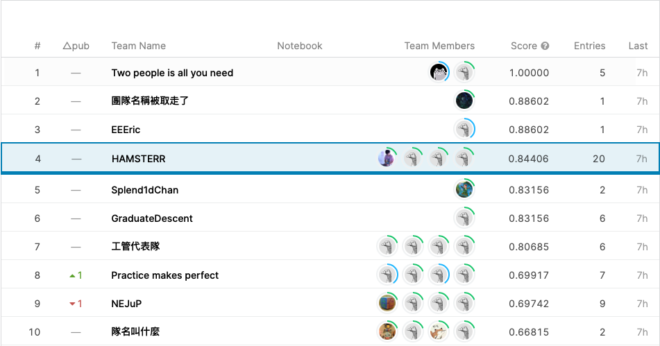

# I'm The Best Coder! Challenge 2020 (Student Category)

## Team
- Team name: `HAMSTERR`
- Team members:
    - Ping-Chia Huang (B06902024)
    - Wu-Jun Pei (B06902029)
    - I-Ju Hsieh (B06902059)
    - Hong-Ying Ke (B06902074)

## Packing Box Suggestion
- [Kaggle Website](https://www.kaggle.com/c/iamthebestcoderstudent2020/overview)
- [Problem Statement](https://docs.google.com/document/d/1TFLmZ5z91Bf_xEiuwfpwu3YzmMYsODmu4Egdic3YRgU/edit) (on Google Drive)

## Our Solution

### Baseline
Our baseline method is simple.

1. We stack the goods along the "height" dimension and consider the stacked goods as an aggregated one.
2. We find the optimal box for the aggregated product.

Although it's obviously not the optimal choice, we got a fair accuracy (**0.64770** on public set) since most orders (>50%) contain only one product.

### A Bruter Approach
After analyzing the order list, we found that there're still many orders containing two products. To achieve a better performance on those orders, we came up with the following approach.

1. The method is similar to the "baseline" method; however, we brute-force all the possible ways so that every possible rotation (6 per product) is considered. (Note that the order of goods are not changed)
2. We find the optimal box for each possible way and choose the best one.

The brute-force took a lot time, so we only applied it when there were only two goods in an order. With this brute-force mechanism, we got a better accuracy (**0.74270** on public dataset)

### A Greedy (?) Property
We applied a greedy property on our baseline method (although it's not theoretically correct).

1. We always sort the size in descending order that shorter edges are aligned.
2. The rest part is the same as our baseline method.

The intuitive hack improved the performance a lot (**0.81140** on public set)

### Another Greedy (?) Property
For those orders containing multiple same products, we tried to aggregate them (along the shortest dimension) before feeding to our algorithm. This property only helped a little.

### The (Non-sense) Pack-as-cat Method
For those we cannot find a suitable box in the previous methods, we try to apply a non-sense method to fix them up.

1. We consider the goods to be liquid (or cats) that we don't need to consider the shape of them and calculate the total volume.
2. We find the smallest box fitting the volume.

However, the method was not helping at all, and we gave it up.

### The Last Greedy (?) Approach
Inspired by *Huffman Encoding*, we came up with the greedy process below.

1. When there're multiple products in a list, we always choose the *smallest* two and combine them together. The combined one is then added back to the list.
2. At last, we find the optimal box for the aggregated object left in the list.

### Final Decision
For every order, let *n* be the number of goods in that product (the products whose quantity is larger than 1 are aggregated beforehand).

1. If $n = 1$, we apply the baseline method.
2. If $2 \le n \le 4$, we apply the brute-force approach.
3. For the rest cases, we apply the last greedy approach (the *Huffman* one).

With this hybrid method, we achieved **0.84440** on public set / **0.84406** on private set.

## Results
In this two-hour event, we won the 3rd place! The gap between us and the fourth place is unignorable (about 1.3%).

### Screenshot of the leaderboard

> Note that the 2nd, 3rd teams on the leaderboard belong to the same team. [[Link to leaderboard](https://www.kaggle.com/c/iamthebestcoderstudent2020/leaderboard)]
